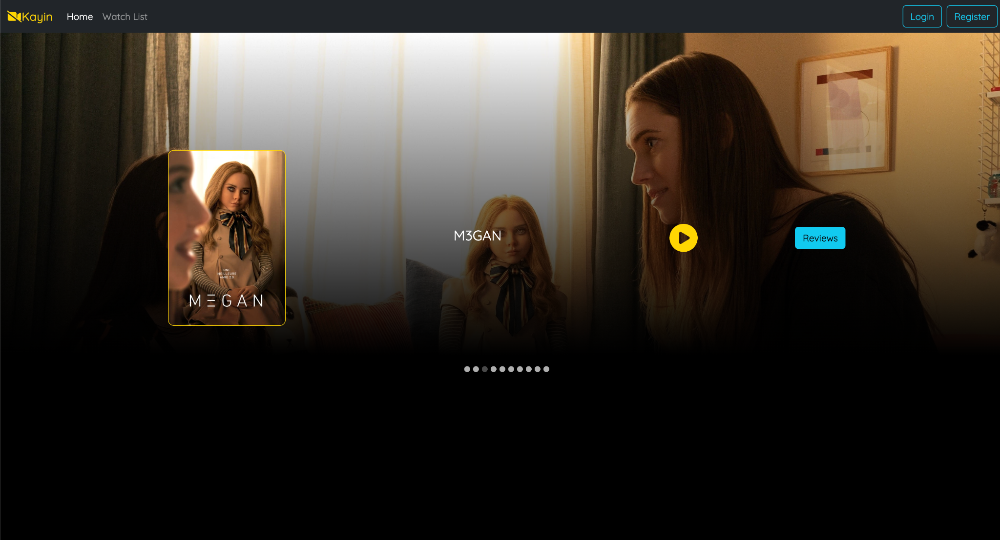
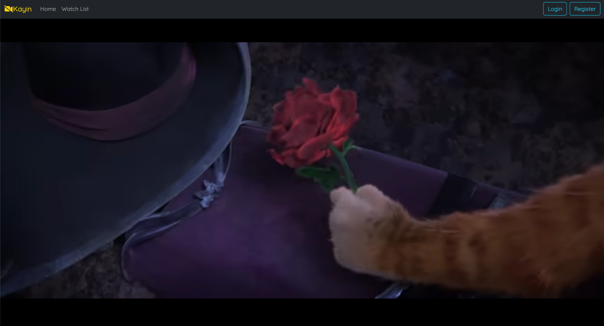
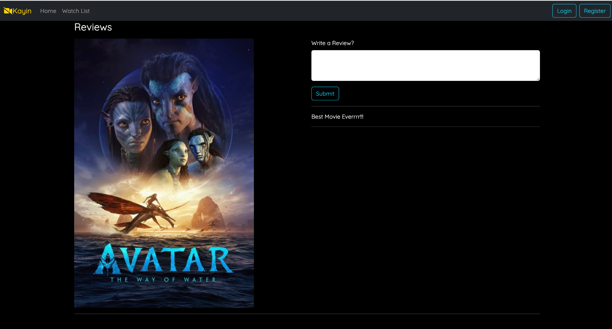

# Movie Review Application

This project is a full-stack web application for browsing and reviewing movies. The application is built using **MongoDB** for the database, **Spring Boot** (Java) for the backend, and **React** for the frontend. The architecture follows a separation of concerns, allowing the frontend and backend to be developed and maintained independently.

## Table of Contents
- [Features](#features)
- [Tech Stack](#tech-stack)
- [Installation](#installation)

## Features
- Browse a list of movies and view details like trailers and descriptions.
- Leave reviews for movies and view reviews left by other users.
- Responsive UI design with React and Bootstrap.
- Loosely coupled architecture between frontend and backend for independent development.

## Tech Stack
### Backend:
- **Java** (JDK 17)
- **Spring Boot** for RESTful API development
- **MongoDB** for database management
- **Maven** for dependency management

### Frontend:
- **React** with Hooks (useState, useEffect)
- **Bootstrap** for responsive design
- **Axios** for making HTTP requests

### Tools:
- **MongoDB Atlas** for cloud-based MongoDB hosting
- **Postman** for API testing
- **IntelliJ IDEA** for Java development
- **VS Code** for React development

## Installation

### Prerequisites:
- [JDK 17](https://www.oracle.com/java/technologies/javase-jdk17-downloads.html)
- [Node.js](https://nodejs.org/en/download/) and npm
- [MongoDB Atlas](https://www.mongodb.com/cloud/atlas/register)
- [Postman](https://www.postman.com/downloads/) (optional, for API testing)

## 1. Main Page
The home page serves as the gateway to various features of the application.

## 2. Youtube Link
By clicking the play button, you will be redirected to the movie's trailer on YouTube.

## 3. Review Page
This section allows users to view and submit reviews for movies.

